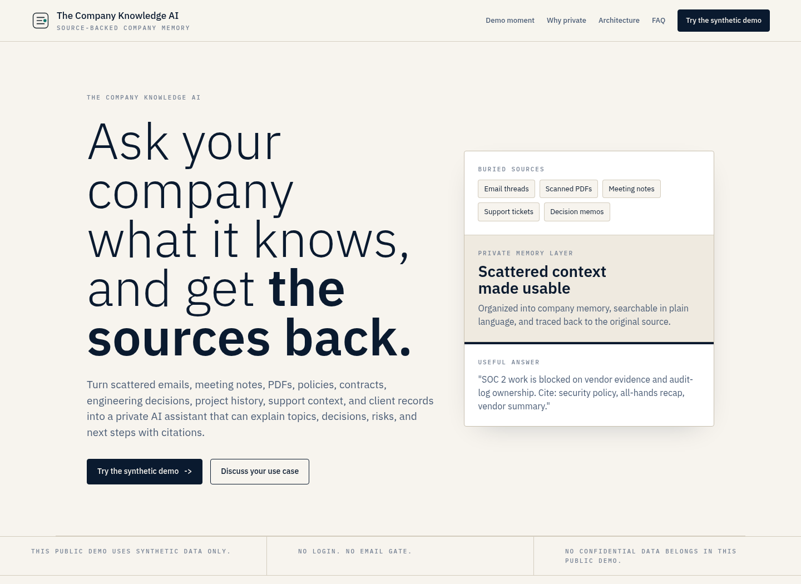
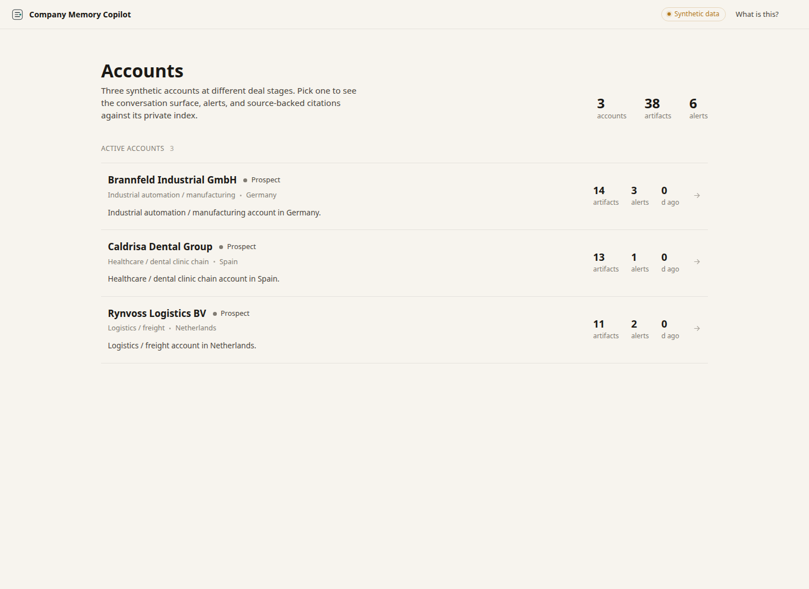
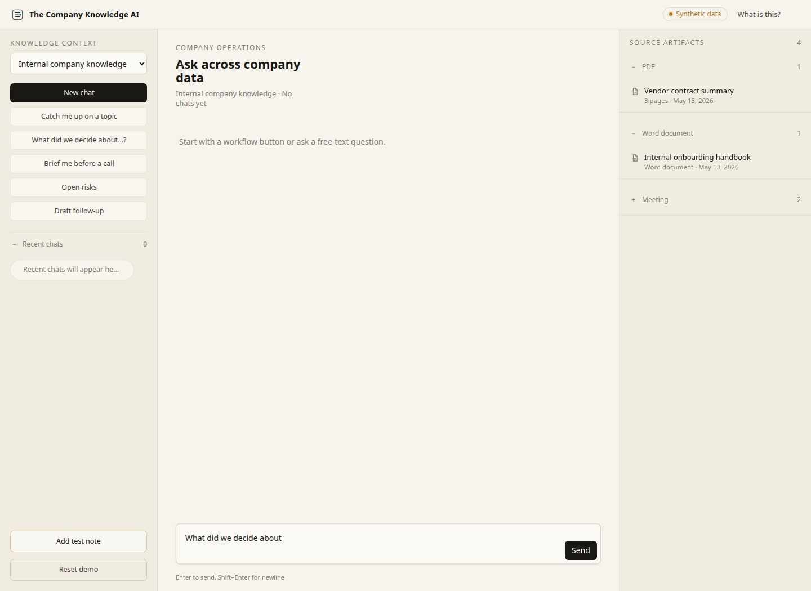
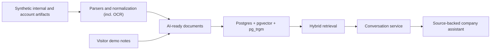

# The Company Knowledge AI

<p align="center">
  
</p>

<p align="center">
  <strong>Open-source reference architecture for a private AI assistant that synthesizes answers from your own company knowledge, with a citation for every claim.</strong>
</p>

<p align="center">
  <a href="https://demo.danielpanea.com"><strong>Live demo</strong></a>
  |
  <a href="#quickstart"><strong>Run locally</strong></a>
  |
  <a href="docs/architecture.md"><strong>Architecture</strong></a>
  |
  <a href="#demo-scope-vs-production-scope"><strong>Scope boundaries</strong></a>
</p>

<p align="center">
  
  
  
  
  
</p>



This repo is a public, synthetic demo of a private company knowledge assistant. It ingests the messy formats real companies actually use (emails, scanned PDFs, Word documents, Markdown memos, meeting transcripts), normalizes them into AI-ready documents, indexes them in Postgres with hybrid retrieval, and synthesizes answers backed by visible citations.

The point is to show the shape of a serious private AI deployment without publishing real client data, auth systems, or production SaaS machinery. The corpus is deliberately broad: onboarding handbooks, internal policies, vendor contract summaries, engineering decision records, strategy recaps, and a few fictional client accounts. The assistant works across all of it, scoped to all company knowledge, internal-only knowledge, or a single account.

## Demo

<video src="src/company_ai/api/static/landing/assets/example_workflow-h264.mp4" controls muted playsinline width="100%" aria-label="Source-backed workflow screen recording"></video>

<table>
  <tr>
    <td width="50%">
      
    </td>
    <td width="50%">
      
    </td>
  </tr>
  <tr>
    <td><strong>Choose the scope.</strong><br>Ask across all company knowledge, only internal knowledge, or a single fictional client account.</td>
    <td><strong>Synthesize, do not just search.</strong><br>Topic catch-ups, decision archaeology, meeting prep, and risk reviews all stay grounded in the selected scope, with every claim cited back to its source artifact.</td>
  </tr>
</table>

The intended public deployment is [demo.danielpanea.com](https://demo.danielpanea.com). Locally, `/` serves the landing page and `/demo` serves the working synthetic demo.

### Demo Recordings

- [Source-backed internal knowledge workflow](src/company_ai/api/static/landing/assets/example_workflow-h264.mp4): choose a scope, ask a workflow question, and inspect the cited artifacts.
- [Live demo note workflow](src/company_ai/api/static/landing/assets/demo_note-h264.mp4): add a brief visitor-scoped note and ask about it immediately.

## What It Proves

- **Multi-format ingestion:** synthetic emails (mbox), text-layer and scanned PDFs (OCR path), Word documents, Markdown memos, meeting transcripts, and structured CSV exports.
- **One AI-ready knowledge layer:** internal and account artifacts become normalized documents with stable IDs, metadata, source references, and embeddings, all in the same store.
- **Hybrid retrieval in Postgres:** full-text search through `pg_trgm`, vector search through `pgvector`, and reranking-ready plumbing, no separate vector database to operate.
- **Synthesis with verifiable citations:** the conversation service builds a context pack, the assistant writes a structured answer against it, and a citation check refuses claims that have no supporting source.
- **Guided workflows over a blank chat box:** topic catch-up, decision archaeology, meeting prep, open risks, and follow-up drafting, all aware of the selected knowledge scope.
- **Scope control:** the same assistant can answer across all company knowledge, only internal company knowledge, or one specific account, with retrieval and citations staying inside the selected boundary.
- **Visitor-safe public demo:** anonymous session cookies, visitor-scoped synthetic notes, no user accounts, and a daily token budget guardrail on the public deployment.
- **Honest scope boundary:** enough architecture to learn from and clone, without pretending to be a turnkey production product.

## Architecture



See [`docs/architecture.md`](docs/architecture.md) for the full walkthrough.

## Repository Map

| Path | Purpose |
| --- | --- |
| [`src/company_ai/api/`](src/company_ai/api/) | FastAPI app, routes, sessions, rate limiting, static frontend serving. |
| [`src/company_ai/ingestion/`](src/company_ai/ingestion/) | Parsers, normalization, OCR path, AI-ready document construction, embedding indexing. |
| [`src/company_ai/retrieval/`](src/company_ai/retrieval/) | Hybrid retrieval and intent handling. |
| [`src/company_ai/agent/`](src/company_ai/agent/) | Conversation orchestration and workflow-backed chat behavior. |
| [`src/company_ai/api/static/`](src/company_ai/api/static/) | Vanilla HTML/CSS/JS demo UI and landing page. |
| [`sql/init.sql`](sql/init.sql) | Single-file Postgres schema applied by `company-ai migrate`. |
| [`deploy/`](deploy/) | Caddy, Docker, and sovereign vLLM deployment notes. |

## Quickstart

Prerequisites: Python 3.11+, `uv`, Docker, and local Postgres through the included compose file.

```bash
uv sync
docker compose up -d postgres
uv run company-ai migrate
uv run company-ai ingest-demo --clean
uv run company-ai serve
```

Open:

- Landing page: `http://127.0.0.1:8000/`
- Synthetic demo: `http://127.0.0.1:8000/demo`

To regenerate the synthetic corpus, including the internal company knowledge artifacts:

```bash
uv run python scripts/generate_synthetic.py --output data/synthetic --reference-date 2026-05-13 --clean
```

## Configuration

Create a real `.env` from `.env.example`. Keep secrets out of git.

| Variable | Purpose |
| --- | --- |
| `DATABASE_URL` | Postgres connection string. |
| `LLM_API_KEY` | Hosted LLM and embedding provider key. |
| `LLM_BASE_URL` | OpenAI-compatible endpoint (OpenRouter, OpenAI, vLLM, etc.). |
| `LLM_MODEL` | Chat model. |
| `EMBEDDING_MODEL` | Embedding model. |
| `DAILY_TOKEN_BUDGET` | Public-demo spend guardrail. |
| `SESSION_SECRET` | Cookie signing secret. |

## Deployment

For the public CPU demo:

```bash
docker compose up -d --build
```

The app container runs migrations and bootstraps the demo corpus on first boot when `rag_documents` is empty. It binds to `127.0.0.1:8000`; use the Caddy config under [`deploy/caddy/`](deploy/caddy/) to terminate HTTPS and reverse-proxy traffic.

### Sovereign Deployment With vLLM

[`deploy/vllm/`](deploy/vllm/) contains the sovereign deployment path: a parallel compose file that swaps hosted chat completions for a local vLLM OpenAI-compatible server. The public demo does not use that stack.

## Demo Scope vs. Production Scope

This repository is a reference architecture, not a turnkey product. It intentionally does not include:

- Production connectors.
- Incremental and event-driven ingestion sync.
- Format detection and content-type sniffing.
- Production OCR for arbitrary scanned documents.
- Deduplication and attachment recovery from email threads.
- Mail thread reconstruction beyond `In-Reply-To` and `References` headers.
- Schema evolution and migrations against live production data.
- Per-user permissions, auth, and row-level security.
- Multi-tenant isolation.
- Audit logging, retention controls, dead-letter queues, and production observability.
- Evaluation methodology, gold-question test sets, and hallucination measurement.
- Backup, monitoring, model-rotation, and incident-response runbooks.

Those are paid implementation concerns, not public-demo features.

## Media To Add Later

- A screenshot of a streamed answer with visible citations.
- A scanned-PDF artifact preview.

## License And Credits

Apache-2.0. Built by [Daniel Panea Lichtig](https://danielpanea.com).
