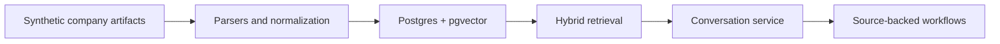

# Private Company AI Demo

## What This Is

This repository is a public demo and open-source reference architecture for a private company memory layer. It ingests synthetic company artifacts, normalizes them into AI-ready account memory, and answers account questions through guided workflows with source citations.

## Try It

The intended public deployment is `https://demo.danielpanea.com`. Locally, the landing page is served at `/` and the working synthetic demo is served at `/demo`.

## Architecture



The demo covers messy sources, AI-ready document generation, embeddings, hybrid retrieval, citation validation, anonymous sessions, visitor-scoped synthetic notes, and a vanilla HTML/CSS/JS frontend. The detailed implementation plan lives in [`docs/`](docs/), especially [`docs/00-overview.md`](docs/00-overview.md).

## Why This Exists

Most useful company context is trapped across inboxes, decks, meeting notes, PDFs, and CRM records. The company-memory-layer idea is to make that context queryable by an AI assistant while preserving ownership, deployment control, and evidence trails. Commercial positioning and client-specific implementation material live outside this public repo.

## Demo Scope vs. Production Scope

This repository is a reference architecture, not a turnkey product. It intentionally does not include:

- Incremental and event-driven ingestion sync.
- Format detection and content-type sniffing.
- OCR for arbitrary scanned documents; the demo OCRs one known PDF, while production-grade OCR requires layout-aware models.
- Deduplication.
- Attachment recovery from email threads.
- Mail thread reconstruction beyond `In-Reply-To` and `References` headers.
- Schema evolution and migrations against live data.
- Per-user permissions and row-level security.
- Multi-tenant isolation.
- Audit logging and retention controls.
- Failure handling, dead-letter queues, and observability beyond basic logs.
- Evaluation methodology, gold-question test sets, and hallucination measurement.
- Production deployment runbooks for backup, monitoring, model rotation, and incident response.

## Local Development

Install dependencies:

```bash
uv sync
```

Generate or refresh the synthetic corpus:

```bash
uv run python scripts/generate_synthetic.py --output data/synthetic --reference-date 2026-05-13 --clean
```

Start Postgres, run migrations, ingest the corpus, and serve the app:

```bash
docker compose up -d postgres
uv run pcad migrate
uv run pcad ingest-demo --clean
uv run pcad serve
```

Open `http://127.0.0.1:8000/` for the landing page or `http://127.0.0.1:8000/demo` for the demo.

## Deployment

For the public CPU demo, create a real `.env` from `.env.example` and run:

```bash
docker compose up -d --build
```

The app container runs migrations and ingests the demo corpus on first boot if `rag_documents` is empty. It binds to `127.0.0.1:8000`; use the example config in [`deploy/caddy/`](deploy/caddy/) to terminate HTTPS and reverse-proxy traffic.

## Sovereign Deployment With vLLM

[`deploy/vllm/`](deploy/vllm/) contains a parallel compose file that swaps chat completions from OpenRouter to a local vLLM OpenAI-compatible server. The public demo does not use this stack. Daniel should test it once on real GPU hardware and add a screenshot or short recording before publishing the repo.

## License and Credits

Apache-2.0. Built by [Daniel Panea Lichtig](https://danielpanea.com).
