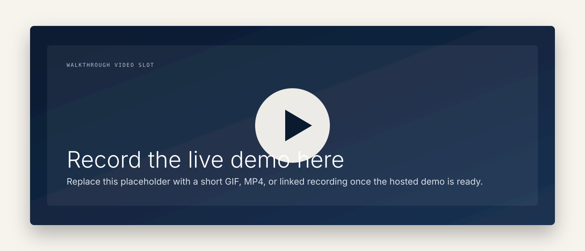
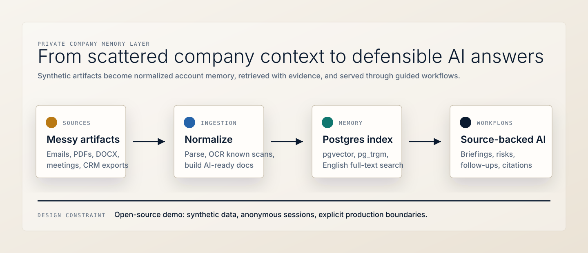
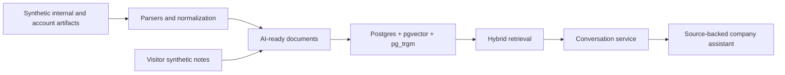

# The Company Knowledge AI

<p align="center">
  
</p>

<p align="center">
  <strong>Open-source reference architecture for a private, source-backed AI assistant over company knowledge.</strong>
</p>

<p align="center">
  <a href="https://demo.danielpanea.com"><strong>Live demo</strong></a>
  |
  <a href="#quickstart"><strong>Run locally</strong></a>
  |
  <a href="docs/00-overview.md"><strong>Architecture docs</strong></a>
  |
  <a href="#demo-scope-vs-production-scope"><strong>Scope boundaries</strong></a>
</p>

<p align="center">
  
  
  
  
  
</p>


This repo is a public, synthetic demo of a private company knowledge assistant. It ingests messy internal and account-related artifacts, normalizes them into AI-ready documents, indexes them in Postgres with hybrid retrieval, and answers questions through guided workflows with citations.

It is designed to show the shape of a serious private AI deployment without publishing client data, auth systems, or production SaaS machinery. The demo is deliberately broader than CRM: it covers internal policies, onboarding, vendor context, engineering decisions, strategy notes, and fictional client history.

## Demo

<table>
  <tr>
    <td width="50%">
      
    </td>
    <td width="50%">
      
    </td>
  </tr>
  <tr>
    <td><strong>Choose the scope.</strong><br>Start with all company knowledge, internal company knowledge, or a fictional client account.</td>
    <td><strong>Ask from the selected context.</strong><br>Topic catch-up, decision archaeology, client briefings, risks, and citations stay tied to the knowledge scope.</td>
  </tr>
</table>

The intended public deployment is [demo.danielpanea.com](https://demo.danielpanea.com). Locally, `/` serves the landing page and `/demo` serves the working synthetic demo.

Video slot for the walkthrough:



## What It Proves

- Multi-format ingestion: synthetic emails, PDFs, Word docs, meeting transcripts, Markdown memos, and CRM-style CSV exports.
- AI-ready company memory: internal and account-related artifacts become normalized documents with metadata, source references, and embeddings.
- Hybrid retrieval: Postgres full-text search, vector search through pgvector, and reranking-ready retrieval plumbing.
- Source-backed answers: the conversation service validates citations and keeps evidence visible.
- Guided workflows: topic catch-up, decision archaeology, call briefing, open risks, and follow-up drafting run with optional knowledge context.
- Optional context scoping: ask across all company knowledge, only internal company knowledge, or a specific fictional client account.
- Visitor-safe demo behavior: anonymous session cookies, visitor-scoped synthetic notes, and no user accounts.
- Public reference boundary: enough architecture to learn from, without pretending to be a turnkey production product.

## Architecture





The detailed package plan lives in [`docs/`](docs/), starting with [`docs/00-overview.md`](docs/00-overview.md).

## Repository Map

| Path | Purpose |
| --- | --- |
| [`src/pcad/api/`](src/pcad/api/) | FastAPI app, routes, sessions, rate limiting, static frontend serving. |
| [`src/pcad/ingestion/`](src/pcad/ingestion/) | Parsers, normalization, OCR path, AI-ready document construction, embedding indexing. |
| [`src/pcad/retrieval/`](src/pcad/retrieval/) | Hybrid retrieval and intent handling. |
| [`src/pcad/agent/`](src/pcad/agent/) | Conversation orchestration and workflow-backed chat behavior. |
| [`src/pcad/api/static/`](src/pcad/api/static/) | Vanilla HTML/CSS/JS demo UI and landing page. |
| [`sql/migrations/`](sql/migrations/) | Versioned Postgres migrations. |
| [`deploy/`](deploy/) | Caddy, Docker, and sovereign vLLM deployment notes. |

## Quickstart

Prerequisites: Python 3.11+, `uv`, Docker, and local Postgres through the included compose file.

```bash
uv sync
docker compose up -d postgres
uv run pcad migrate
uv run pcad ingest-demo --clean
uv run pcad serve
```

Open:

- Landing page: `http://127.0.0.1:8000/`
- Synthetic demo: `http://127.0.0.1:8000/demo`

To regenerate the synthetic corpus, including the internal company knowledge artifacts:

```bash
uv run python scripts/generate_synthetic.py --output data/synthetic --reference-date 2026-05-13 --clean
```

## Configuration

Create a real `.env` from `.env.example`. Keep secrets out of git.

| Variable | Purpose |
| --- | --- |
| `DATABASE_URL` | Postgres connection string. |
| `OPENROUTER_API_KEY` or `LLM_API_KEY` | Hosted LLM and embedding provider key. |
| `LLM_BASE_URL` | OpenAI-compatible endpoint, usually OpenRouter or local vLLM. |
| `LLM_MODEL` | Chat model. |
| `EMBEDDING_MODEL` | Embedding model. |
| `DAILY_TOKEN_BUDGET` | Public-demo spend guardrail. |
| `SESSION_SECRET` | Cookie signing secret. |

## Deployment

For the public CPU demo:

```bash
docker compose up -d --build
```

The app container runs migrations and bootstraps the demo corpus on first boot when `rag_documents` is empty. It binds to `127.0.0.1:8000`; use the Caddy config under [`deploy/caddy/`](deploy/caddy/) to terminate HTTPS and reverse-proxy traffic.

### Sovereign Deployment With vLLM

[`deploy/vllm/`](deploy/vllm/) contains the sovereign deployment path: a parallel compose file that swaps hosted chat completions for a local vLLM OpenAI-compatible server. The public demo does not use that stack.

## Demo Scope vs. Production Scope

This repository is a reference architecture, not a turnkey product. It intentionally does not include:

- Production connectors.
- Incremental and event-driven ingestion sync.
- Format detection and content-type sniffing.
- Production OCR for arbitrary scanned documents.
- Deduplication and attachment recovery from email threads.
- Mail thread reconstruction beyond `In-Reply-To` and `References` headers.
- Schema evolution and migrations against live production data.
- Per-user permissions, auth, and row-level security.
- Multi-tenant isolation.
- Audit logging, retention controls, dead-letter queues, and production observability.
- Evaluation methodology, gold-question test sets, and hallucination measurement.
- Backup, monitoring, model-rotation, and incident-response runbooks.

Those are paid implementation concerns, not public-demo features.

## Media To Add Later

- Replace `docs/assets/readme/video-placeholder.svg` with a short walkthrough GIF or MP4 once the hosted demo is recorded.
- Add a screenshot of a streamed answer with visible citations after the public model route is finalized.
- Add one scanned-PDF artifact preview once the synthetic document rendering path is stable enough to show.

## License And Credits

Apache-2.0. Built by [Daniel Panea Lichtig](https://danielpanea.com).
